<!-- ============================================================
     Profile README for @aayuuuushhh
     Animated banner + divider live in /assets (pure SVG, no server).
     Stat cards are served live by github-profile-summary-cards
     (no workflow needed). Snake + 3D contributions are generated by
     GitHub Actions in /.github/workflows on every push and daily.
     ============================================================ -->

<div align="center">

<a href="https://aayushshahnirala.com.np">
  
</a>

<a href="https://aayushshahnirala.com.np">
  
</a>

<p>
  <a href="https://aayushshahnirala.com.np"></a>
</p>

<p>
  <a href="https://linkedin.com/in/aayushshahnirala"></a>
  <a href="mailto:niralaaayush105@gmail.com"></a>
  <a href="https://github.com/aayuuuushhh?tab=followers"></a>
  
</p>

</div>


## 🧑‍💻 `whoami`


I'm pursuing a **B.Sc. (Hons) Computer Science with Artificial Intelligence** at **Sunway College**, affiliated with **Birmingham City University, UK**.

I build **AI-powered software**, **full-stack web apps** and **business tools** that solve real problems, and I like turning ideas into products people actually use.

🌐 See everything I've built at **[aayushshahnirala.com.np](https://aayushshahnirala.com.np)**

```python
class Aayush:
    role      = "AI & Full Stack Developer"
    base      = "Kathmandu, Nepal 🇳🇵"
    portfolio = "https://aayushshahnirala.com.np"
    focus     = ["Artificial Intelligence", "Machine Learning", "MERN Stack"]
    learning  = ["System Design", "Scalable Backend Architecture", "LLMs"]
    mindset   = "Always shipping, always learning 🚀"

    def say_hi(self):
        return "Let's build something intelligent together!"
```

<br clear="right" />

<details>
<summary><b>⚡ Click for a quick boot sequence</b></summary>
<br />

```console
aayush@dev:~$ ./boot --profile
[ OK ] Loading neural pathways ............ done
[ OK ] Mounting MERN stack ................ done
[ OK ] Compiling ideas into products ...... done
[ OK ] Caffeine levels .................... critical ☕
[ OK ] Portfolio online → https://aayushshahnirala.com.np
aayush@dev:~$ echo $STATUS
Open to internships, collaborations & hackathons 🤝
```

</details>


## 🚀 Featured Projects

<table>
  <tr>
    <td width="50%" valign="top">
      <h3>💊 <a href="https://github.com/aayuuuushhh/MedSync">MedSync</a></h3>
      <p>AI-powered medicine management system with QR-based medicine verification, smart inventory tracking and AI-assisted recommendations.</p>
      
      
      
      <br /><br />
      <a href="https://github.com/aayuuuushhh/MedSync"></a>
    </td>
    <td width="50%" valign="top">
      <h3>🛒 Shakti Mart</h3>
      <p>Intelligent supermarket management system covering inventory, billing, analytics, customer management and AI integration.</p>
      
      
      
      <br /><br />
      <a href="https://aayushshahnirala.com.np"></a>
    </td>
  </tr>
  <tr>
    <td width="50%" valign="top">
      <h3>🚕 Sawari Sathi</h3>
      <p>Ride-sharing platform with a modern UI/UX, real-time ride tracking and an advanced admin dashboard.</p>
      
      
      
      <br /><br />
      <a href="https://aayushshahnirala.com.np"></a>
    </td>
    <td width="50%" valign="top">
      <h3>🧬 AI Drug Interaction Checker</h3>
      <p>Machine learning model that predicts potentially harmful drug interactions to support safer medication use.</p>
      
      
      <br /><br />
      <a href="https://aayushshahnirala.com.np"></a>
    </td>
  </tr>
</table>


## 🛠️ Tech Stack

<div align="center">

| Languages | Frontend | Backend | Database | Tools & Platforms |
| :---: | :---: | :---: | :---: | :---: |
|  |  |  |  |  |

</div>

## 🔭 Currently Exploring

<p align="center">
  
  
  
  
  
</p>

## 🎯 2026 Roadmap

```diff
+ Build production-level AI applications
+ Contribute to open source
+ Publish AI research projects
+ Learn advanced system design
+ Master full-stack development
+ Launch my own SaaS products
```


## 📊 GitHub Analytics

<div align="center">


</div>

### 🏙️ My Contributions in 3D

<div align="center">
<picture>
  <source media="(prefers-color-scheme: dark)" srcset="https://raw.githubusercontent.com/aayuuuushhh/aayuuuushhh/main/profile-3d-contrib/profile-night-rainbow.svg" />
  <source media="(prefers-color-scheme: light)" srcset="https://raw.githubusercontent.com/aayuuuushhh/aayuuuushhh/main/profile-3d-contrib/profile-green-animate.svg" />
  
</picture>
</div>

<details>
<summary><b>⏰ When do I code? (click to reveal)</b></summary>
<br />
<div align="center">
  
</div>
</details>


## 🐍 Contribution Snake

<div align="center">
<picture>
  <source media="(prefers-color-scheme: dark)" srcset="https://raw.githubusercontent.com/aayuuuushhh/aayuuuushhh/output/github-contribution-grid-snake-dark.svg" />
  <source media="(prefers-color-scheme: light)" srcset="https://raw.githubusercontent.com/aayuuuushhh/aayuuuushhh/output/github-contribution-grid-snake.svg" />
  
</picture>
</div>


<div align="center">

### 💬 Words I Code By


<br /><br />

### 🤝 Let's Build Something Together

<a href="https://aayushshahnirala.com.np"></a>
<a href="mailto:niralaaayush105@gmail.com"></a>
<a href="https://linkedin.com/in/aayushshahnirala"></a>

<br /><br />

⭐ **If you like my work, drop a star on a repo — it keeps me shipping!**

*"Turning Ideas into Intelligent Solutions."*


</div>
